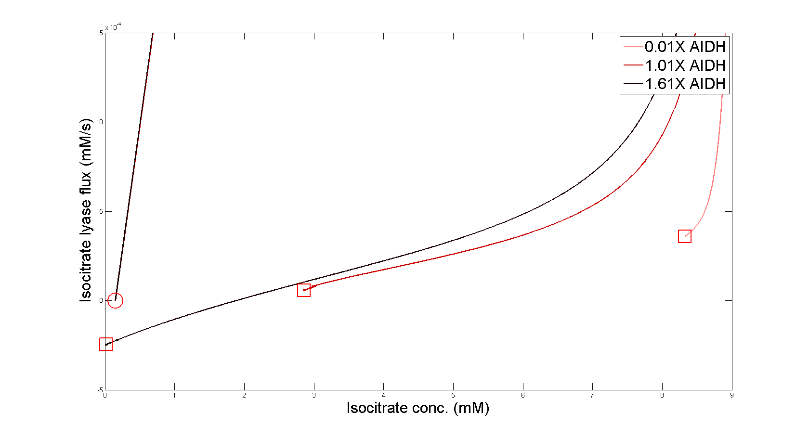

# MetabolSim

A numerical differential equation solver for biochemical networks, based on a descriptive netlist format inspired by [SPICE](https://en.wikipedia.org/wiki/SPICE) to describe electronic circuits for simulation. 

MetabolSim netlist entries describe network elements like so:

```
ICD> -5 6 [0.000008 0.006625 0.00013 0.00006625] (1.0)
```

In this example ICD is [isocitrate dehydrogenase](https://en.wikipedia.org/wiki/Isocitrate_dehydrogenase), an important enzyme in the [citric acid cycle](). The parameters in the list are enzyme kinetics coefficients, and the number in parenthesis is the relative concentration of the enzymei. The two naked numbers in between the enzyme designation and the list of kinetics coefficients denotes the nodes that the enzyme connects to, and defines the sign convention for normal flux. 
of this

Following the biochemical network description, MetabolSim expects extra information in the `*Met` section. This section contains the starting concentrations (again in parenthesis) for the metabolites themselves, each assigned to a node.

```
Met
1 (0.0005)
2 (0.0000014)
3 (0.0000001)
4 (0.009)
5 (0.00015)
6 (0.0002)
7 (0.00004)
8 (0.006)
9 (0.0003)
10 (0.005)
11 (0.004)
12 (0.0001)
```

Finally, the last line contains some recommended parameters for running the network model.  


```
*Run(t,10.0,0.01)* 
```

MetabolSim currently uses a second order [Runge-Kutta](https://en.wikipedia.org/wiki/Runge%E2%80%93Kutta_methods) method for computing metabolite concentrations.


# Usage

To run a simulation of the demo biochemical network with default settings, simply cd to the project root folder and run:

```
python metabolsim/metabolsim.py
```

MetabolSim facilitates experiments like the one shown in the figure below. By simulating the demo network with varying concentrations of isocitrate dehydrogenase, we can see that the equilibrium flux (red squares) through isocitrate lyase becomes positive for very small concentrations of isocitrate dehydrogenase. This is a simplified example, but similar model insights could help pinpoint intervention targets for treating disease.

<div align="center">

</div>

# Backstory

You may notice that the author of MetabolSim was apparently ignorant of or unwilling to use NumPy, despite relying heavily on matrix and vector math. The reason for this is simple, and it is that MetabolSim was my first Python project, and so I wrote my own classes for vectors/matrices and their mathematical operators. Although the demo network runs quickly on a modern computer, there are plenty of performance improvements left on the table should one want to simulate Michaelis-Mentis kinetics at scale. 


<!-- I had no experience with NumPy at the time, and so I wrote my own classes for matrix and vector math. That means it's likely a lot slower than it could be. On the plus side this means there are almost no dependencies as the project was written in pure Python (but it does use `time` to timestamp results files). -->


<!-- Updating MetabolSim for better performance and stylistic consistency is on a TODO list, but it's a pretty long list at this point. ;) -->
